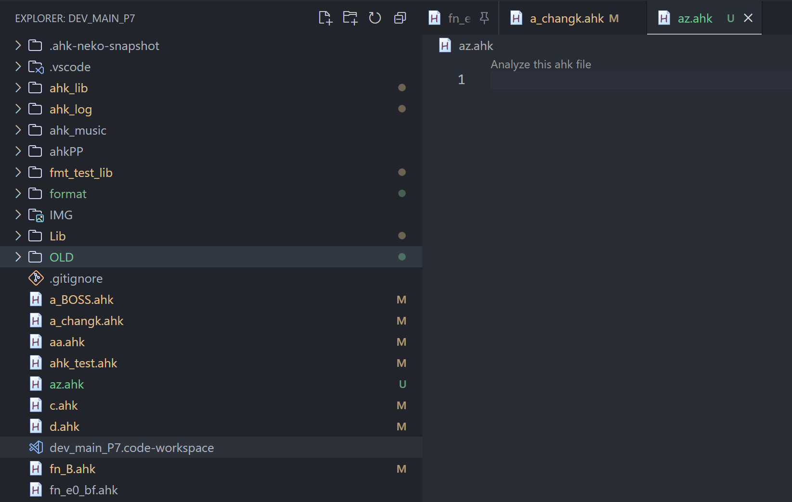

# ahk-v1-icon README

just change `.ahk` icon like

> source <https://www.autohotkey.com/boards/viewtopic.php?t=68147>

## Preview

## other

if you need ahk v1.1 highlight / hover ...etc, you nee it <https://marketplace.visualstudio.com/items?itemName=cat1122.vscode-autohotkey-neko-help>